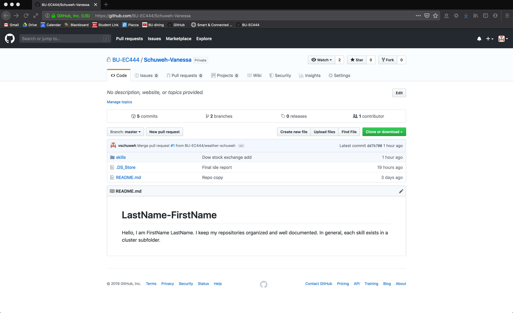

#  Set up and Use GitHub Individually

Author: Vanessa Schuweh, 2019-09-06

## Summary
In this skill I used my GitHub account to create a repo using the lastname-firstname template provided in the BU-EC444 organization. I also dowloaded GitHub Desktop to commit and push changed files in my local machine to GitHub more easily.

## Sketches and Photos

## Modules, Tools, Source Used in Solution

* GitHub
* GitHub Desktop

## Supporting Artifacts

* [My GitHub Repo](https://github.com/BU-EC444/Schuweh-Vanessa)

-----

## Reminders
- Repo is private
