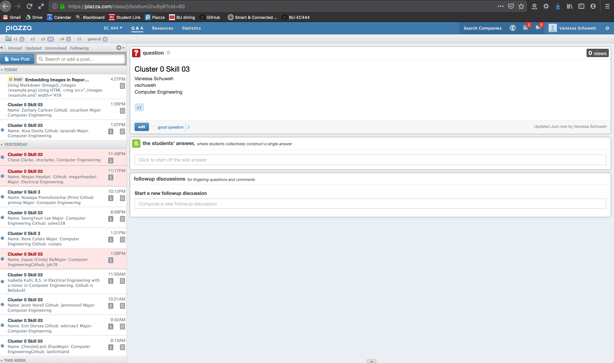

#  Get access to Piazza and post something

Author: Vanessa Schuweh, 2019-09-06

## Summary

In this skill, I accepted the invitation to join the EC444 Piazza page and created a post with my name, GitHub username, and major to show that i have access and can post on the forum.

## Sketches and Photos

## Modules, Tools, Source Used in Solution

* Piazza

## Supporting Artifacts

* [My Piazza post](https://piazza.com/class/jzbodium2nu5y6?cid=64)

-----

## Reminders
- Repo is private
