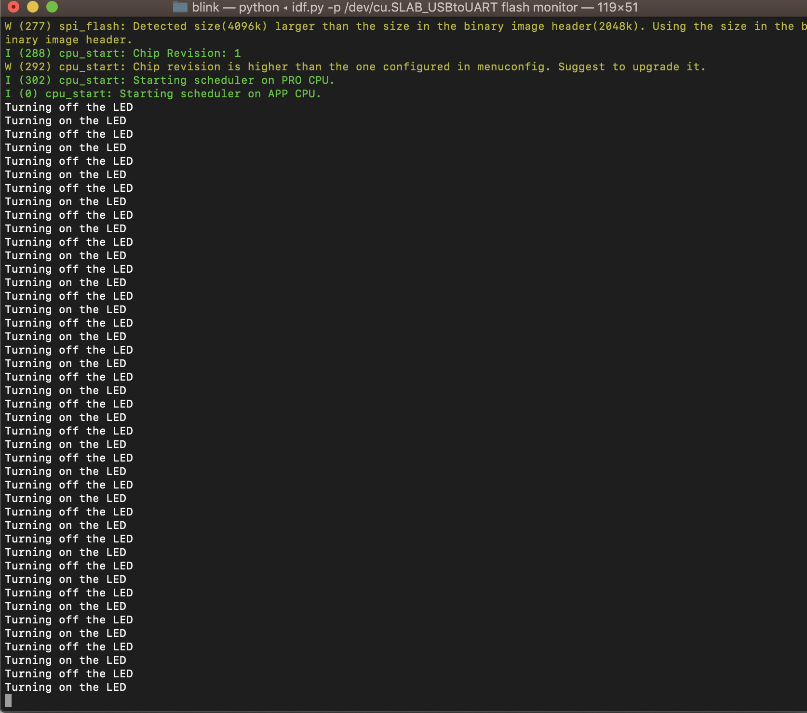

#  Setup Espressif Toolchain

Author: Vanessa Schuweh, 2019-09-06

## Summary

In this skill, I installed the USB driver from Silabs then followed the Espressif Getting started Guide to install prerequisites, ESP-IDF, set up tools and environment variables. I verified that my toolchain worked by having Hello World show up on the console. I then repeated the process but this time had the LED blink on the ESP32.

## Sketches and Photos

Video of blinking red onboard LED.

## Modules, Tools, Source Used in Solution

* ESP-IDF
* ESP32

## Supporting Artifacts

* [Getting Started Guide](https://docs.espressif.com/projects/esp-idf/en/latest/get-started/index.html)
-----

## Reminders
- Repo is private
