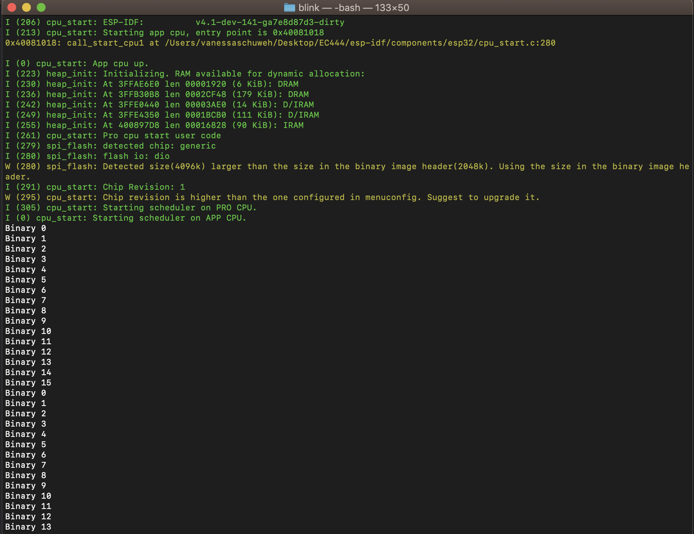

#  Use GPIO to Drive LEDs

Author: Vanessa Schuweh, 2019-09-20

## Summary
In this skill I wired 4 LEDs to GPIO pins on the ESP32 to count up in binary. I used GPIO pins A0, A1, A5, and 21 to connect to the LEDs. LED on corresponds to the GPIO pin going high(1) and LED off corresponds to GPIO pin going low(0). The 4 LEDs represent bit 0 through 4 and counts up in binary. The count wraps around to 0 once it reaches 15. I used the gpio_set_level() function to turn on and off the LEDs. Lastly, I used the GitHub esp-idf example blink file as a baseline and modified it to accomplish this skill.

## Sketches and Photos
Screenshot of console showing decimal equivalent of binary value being displayed

Demo of LED's counting from 0 to 15 then wrapping and counting 0 to 13 as shown on console image above

## Modules, Tools, Source Used in Solution
* Counting in binary
* ESP32 data sheet to find GPIO pin numbers

## Supporting Artifacts
* [huzzah32-ESP32](https://cdn-learn.adafruit.com/downloads/pdf/adafruit-huzzah32-esp32-feather.pdf)
* [GitHub esp-idf blink examaple](https://github.com/espressif/esp-idf/tree/master/examples/get-started/blink)

-----

## Reminders
- Repo is private
