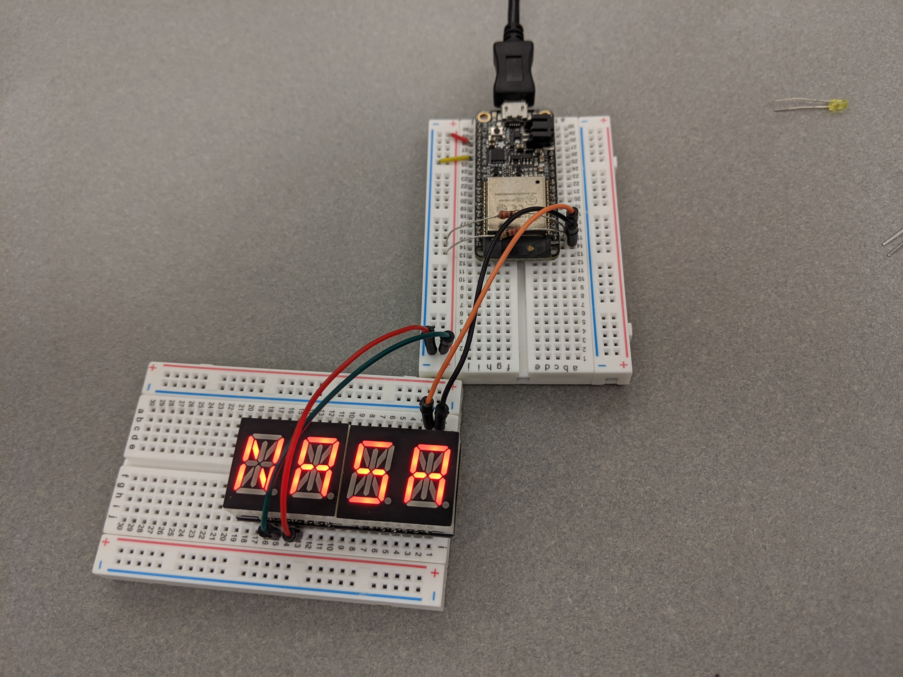

#  Alphanumeric Display

Author: Vanessa Schuweh, 2019-09-20

## Summary
In this task I wired the I2C Alphanumeric display to the ESP32 to display user input. Upon staring the program, the user is prompted to enter up to 4 characters. The input is error checked to ensure it is at most 4 characters, and then it is shown on the display. I used scanf() to read in the user input then evaluated each character in the character array (user input scans in as a character array). Each of those characters is saved in the program as its ASCII equivalent which is then used to find the bitmap of the character in a table of bitmaps which was found on the GitHub link below. I used the esp-idf I2C example from GitHub as my baseline and modified it to complete this task.

## Sketches and Photos
Picture of wiring

Demo of Alphanumeric Display and error checking                                          

## Modules, Tools, Source Used in Solution

* ESP-IDF
* I2C 14-Segment Alphanumeric Display
* Resistors
* GPIO pins

## Supporting Artifacts

* [GitHub: Bitmap table](https://github.com/adafruit/Adafruit_LED_Backpack/blob/master/Adafruit_LEDBackpack.cpp)
* [GitHub ESP-IDF I2C Example](https://github.com/espressif/esp-idf/tree/master/examples/peripherals/i2c)

-----

## Reminders
- Repo is private
