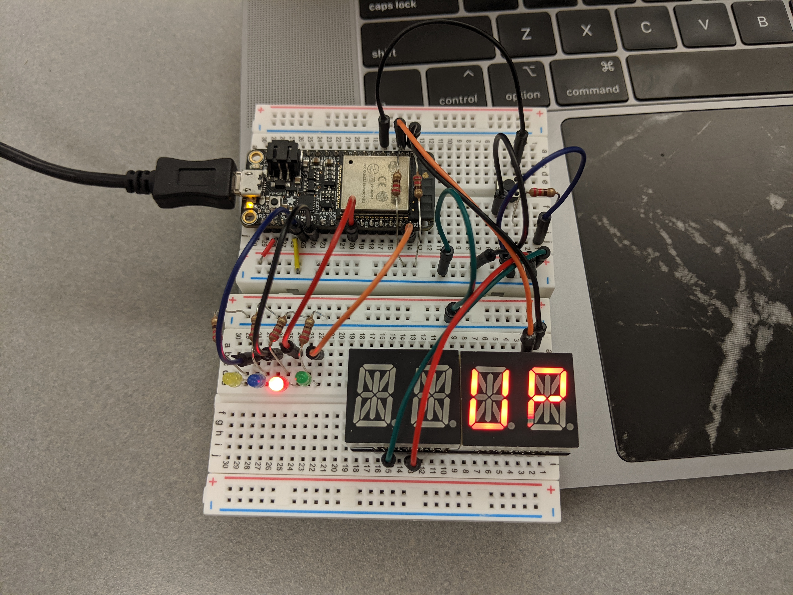

#  RTOS TASKs – Free RTOS

Author: Vanessa Schuweh, 2019-09-20

## Summary
In this skill, I combined the skills from "GPIO to Drive LEDs" and "Alphanumeric Display" to make a binary counter that can count up or down. As with the previous skill, the LEDs show the current binary count with LED on corresponding to high(1). I wired a button so that when the button is pressed, the binary counting switches directions from Up to down and vice versa. I used the gpio_get_level() function to sense if the button is pressed. When the button is pressed GPIO pin 32 on the ESP32 will receive input signal 1 which represents button pressed. The current direction of the count (up or down) will be shown on the alphanumeric display. I merged my gpio.c and alphanumeric.c files to create my baseline then modified it to complete this skill.

## Sketches and Photos

Picture of wiring

Demo video                                           

## Modules, Tools, Source Used in Solution
* ESP32
* I2C Alphanumeric display
* LEDs

## Supporting Artifacts
* [My GitHub gpio](https://github.com/BU-EC444/Schuweh-Vanessa/tree/master/skills/cluster-1-clock/09-gpio)
* [My GitHub alphanumeric](https://github.com/BU-EC444/Schuweh-Vanessa/tree/master/skills/cluster-1-clock/10-alpha)

-----

## Reminders
- Repo is private
