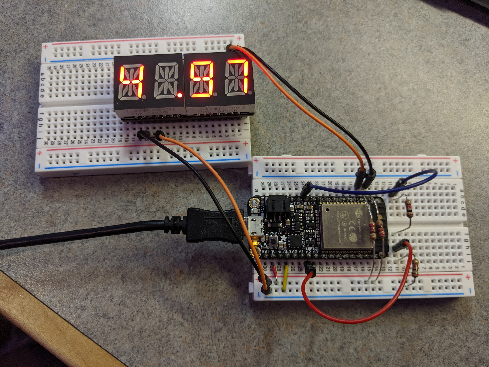

#  Battery Monitor

Author: Vanessa Schuweh, 2019-10-08

## Summary

In this skill, I wired the Alphanumeric Display to the ESP32 and included a voltage divider circuit on the ADC pin. Every 100ms, the battery voltage is read and my code averages the 10 samples each second. This averaged value gets displayed on both the console and on the Alphanumeric Display.

## Sketches and Photos

## Modules, Tools, Source Used in Solution
* ADC
* I2C

## Supporting Artifacts

* [ADC Guide](https://docs.espressif.com/projects/esp-idf/en/latest/api-reference/peripherals/adc.html)
-----

## Reminders
- Repo is private
