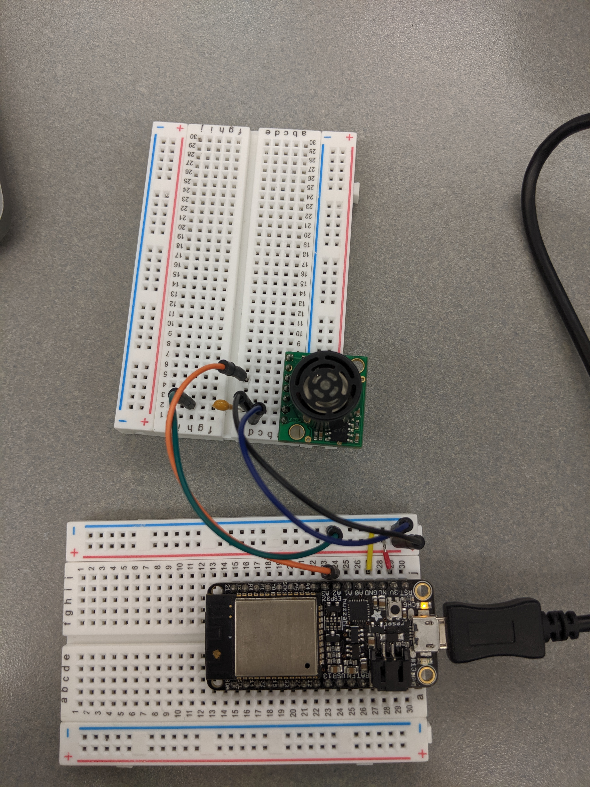

#  Ultrasonic

Author: Vanessa Schuweh, 2019-10-08
## Summary

In this skill I wired the Maxbotics Ultrasonic Range Finder to the ESP32 ADC through an analog port. Every 2 seconds, the Range Finder sends data in millivolts. My code takes this and uses the provided data sheet to convert these values to meters and display the distance on the console.

## Sketches and Photos

## Modules, Tools, Source Used in Solution

* ADC
* Ultrasonic Sensor

## Supporting Artifacts

* [Specs](https://www.maxbotix.com/documents/HRLV-MaxSonar-EZ_Datasheet.pdf)
-----

## Reminders
- Repo is private
