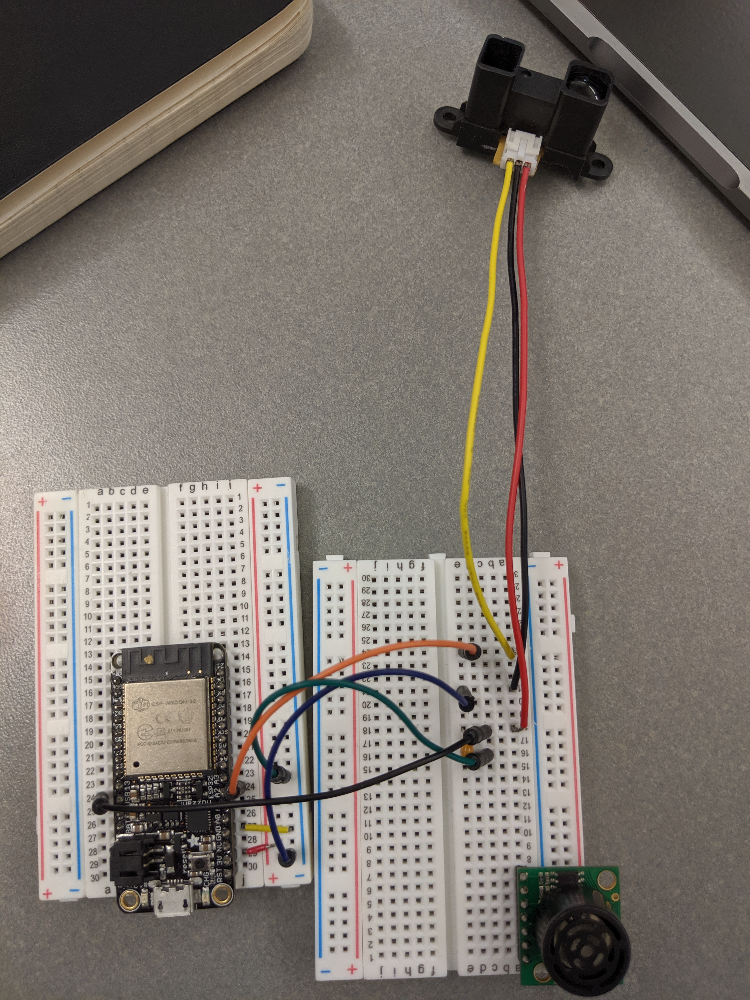
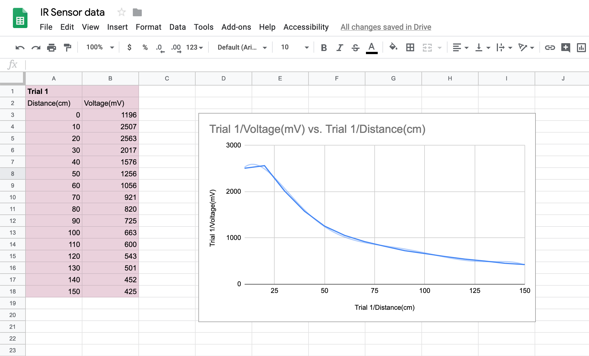

#  IR Rangefinder

Author: Vanessa Schuweh, 2019-10-08

## Summary

In this skill I wired the Sharp Long Range IR Sensor to the ESP32 ADC. Every 2 seconds, the IR Sensor gives values in millivolts, and I plotted the values it gave for different known distances. I used linear regression to find a conversion from the millivolt values to meters and implemented it in my code to show the distances in the console.

## Sketches and Photos

## Modules, Tools, Source Used in Solution
* ADC
* ESP-IDF example

## Supporting Artifacts
* [IR Data Sheet](https://www.sparkfun.com/datasheets/Sensors/Infrared/gp2y0a02yk_e.pdf)
* [ADC example](https://github.com/espressif/esp-idf/tree/39f090a4f1dee4e325f8109d880bf3627034d839/examples/peripherals/adc)

-----

## Reminders
- Repo is private
