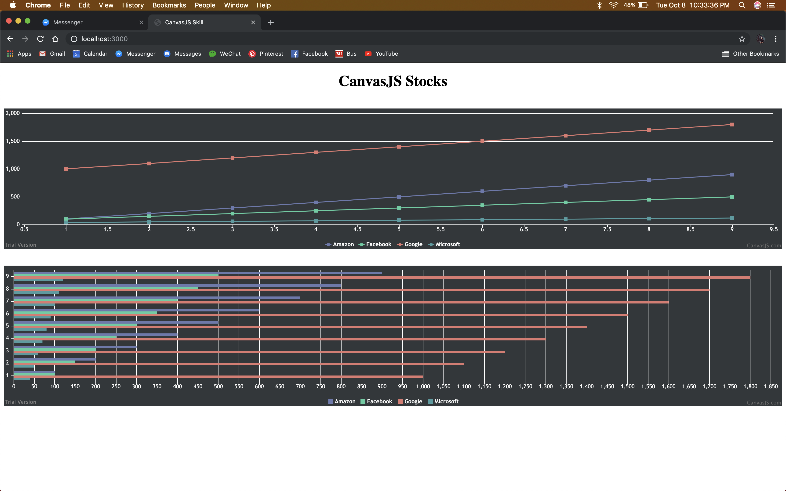

#  CanvasJS

Author: Vanessa Schuweh, 2019-10-08
## Summary

In this skill, I used CanvasJS to plot and display given data. I used the provided stocks data in a CSV formatted text file. My code read/formatted the data from this file and put it in the CanvasJS chart in my HTML file to display.

## Sketches and Photos

## Modules, Tools, Source Used in Solution
* Parsing CSV
* CanvasJS

## Supporting Artifacts

* [Charts](https://canvasjs.com/javascript-charts/)

-----

## Reminders
- Repo is private
