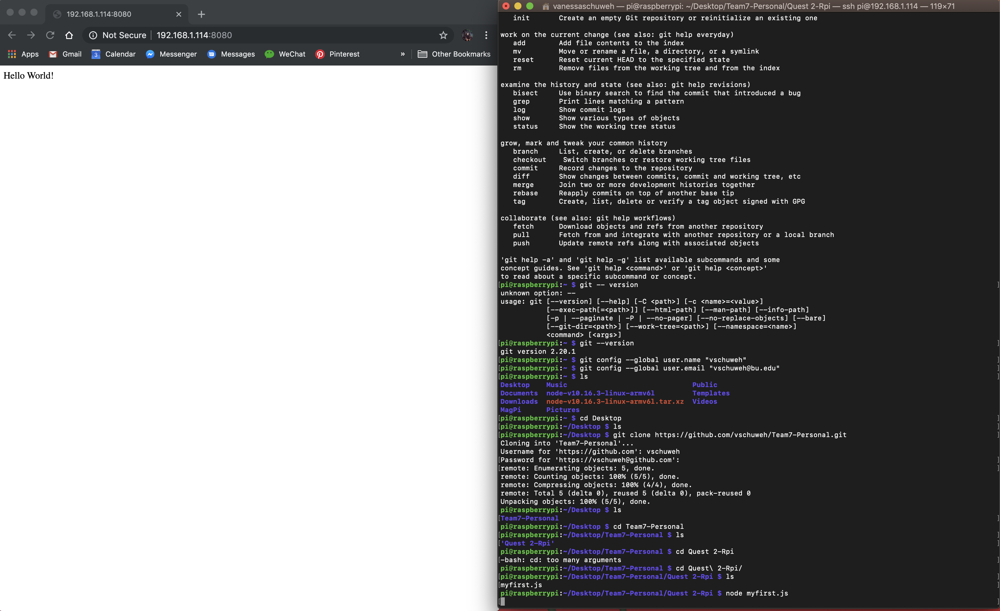

#  Raspberry Pi

Author: Jennifer Norell, Vindhya Kuchibhotla, Vanessa Schuweh, 2019-10-08

## Summary
In this skill, we ran a simple NodeJS server on the RPi. We set up the Rasberry Pi using NOOBs and Raspbian and followed the OS installation guide. Once this was completed, we configured SSH, installed Node, and set up GitHub through the Pi. Then, we used our Node.JS "Hello World" example and ran it via the Pi on our laptop screen, proven by the ip address in the URL. 

## Sketches and Photos

Hello World Node Example via SSH into RaspPi:

## Modules, Tools, Source Used in Solution
- Raspberry Pi
- Node JS

## Supporting Artifacts
* [downloads](https://www.raspberrypi.org/downloads/)
* [ssh](https://www.raspberrypi.org/documentation/remote-access/ssh/)

-----

## Reminders
- Repo is private
