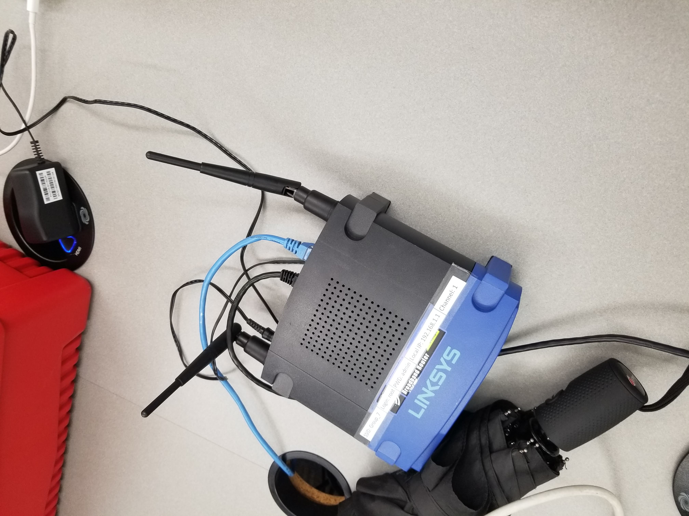
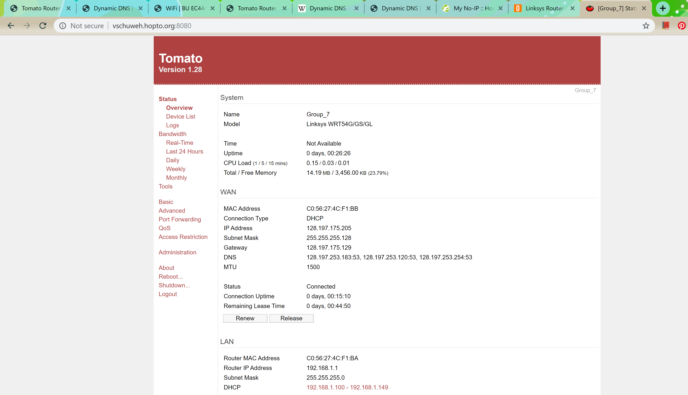

# Tomato Router

Author: Vanessa Schuweh, 2019-10-24

## Summary
In this skill, my team and I set up our Linksys WRT54GS/GL Tomato Router. We first started by downloading the Tomator firmware, connected our router to the ethernet port and the other side to the dongle for the computer, and then reset the router. We then logged into our router by going to http://192.168.1.1 and completeing the configuration process through the Tomato page. Once the router was configured (visible and accessible via the device list) and once we set up Dynamic DNS, I was able to access the tomato site through port forwarding.

## Sketches and Photos
Router external setup:

Tomato Site for Router Config via Dynamic DNS

## Modules, Tools, Source Used in Solution
- Tomato configuration

-----

## Reminders
- Repo is private
