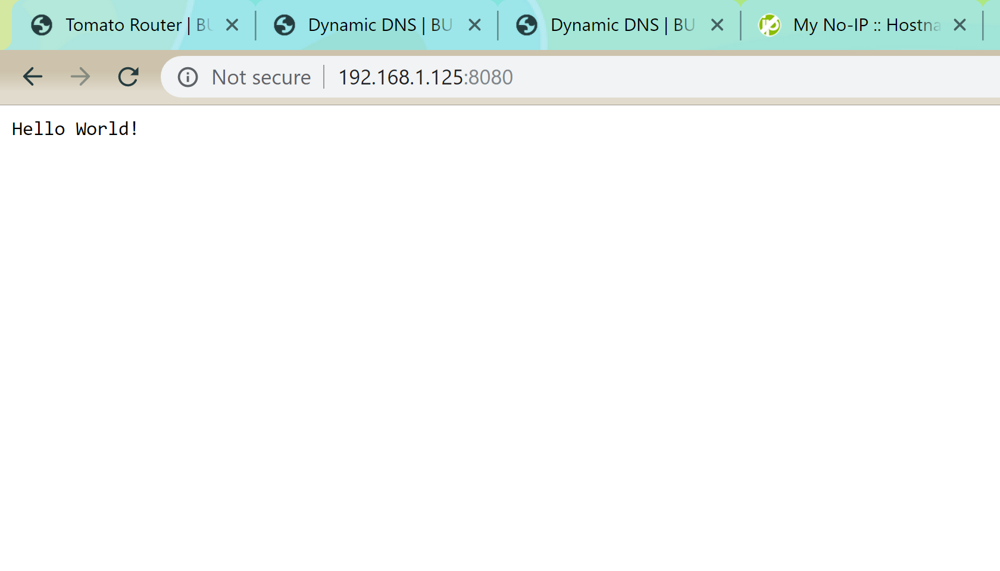
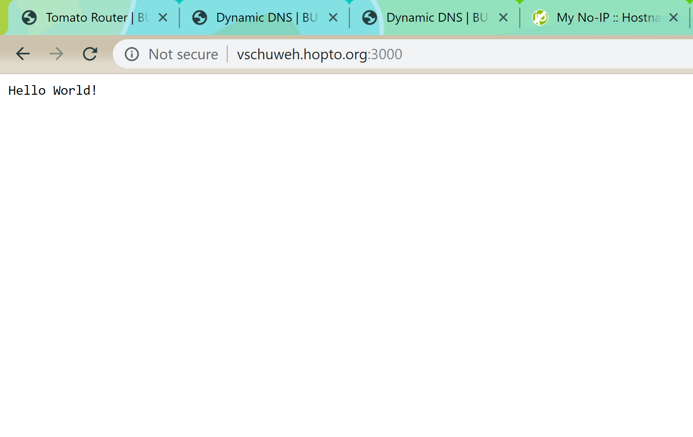
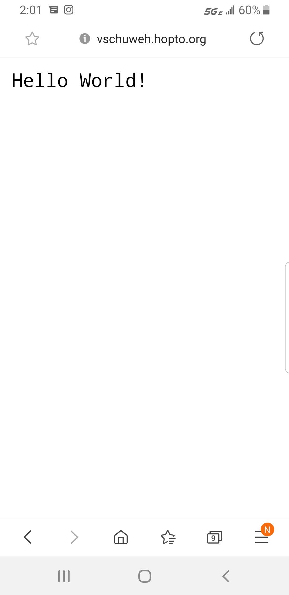

#  Dynamic DNS

Author: Vanessa Schuweh, 2019-10-24

## Summary
In this skill, we signed up for a free dynamic DNS account from No-IP in order to translate host names into IP addresses so that external traffic can access the site without having internal or local information. Once we connected DDNS to the router, I was able to access the Tomato configuration website. Then, we ran the Hello World NodeJS server on my partner's laptop using Port 8080. Using port forwarding, I could access the Hello World, first internally by being connected to Group 7 wifi and using local IP addresses, and then secondly regardless of my wifi network via vschuweh.hopto.org:3000.

## Sketches and Photos
Internal DDNS connection (using Group_7 wifi through BU 802.1 ethernet):

External DDNS connection (on laptop using BU 802.1x):

External DDNS connection (on phone using 4G LTE data):

## Modules, Tools, Source Used in Solution
- No-IP
- Tomato Router

-----

## Reminders
- Repo is private
