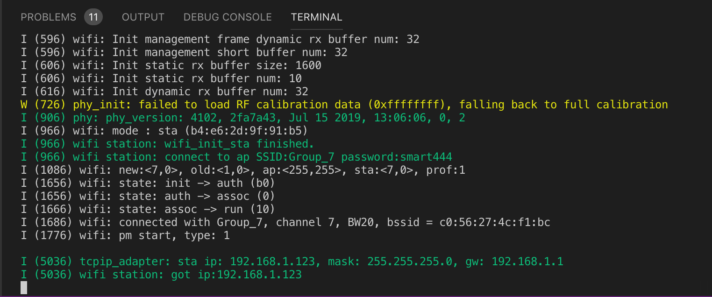
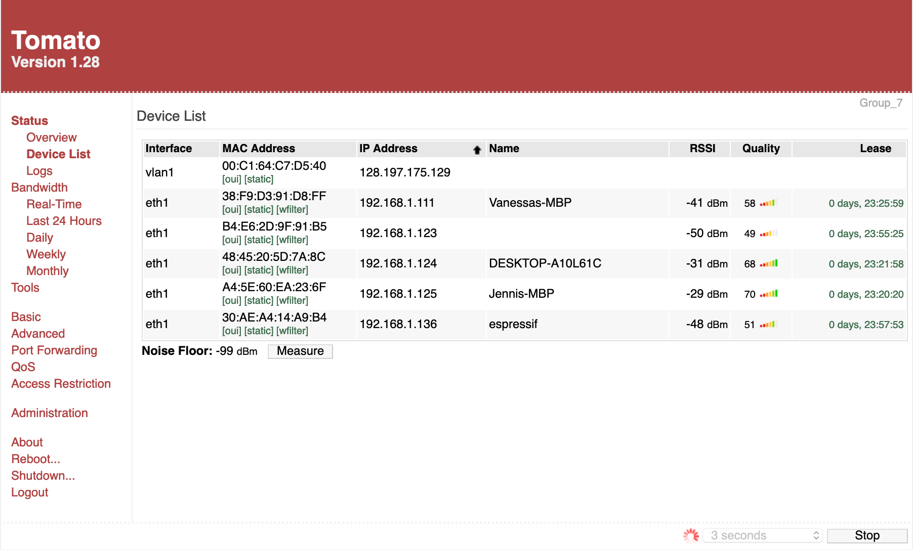

#  WiFi

Author: Vanessa Schuweh, 2019-10-24

## Summary

In this skill, I connected my ESP32 to WiFi. I used the WiFi Station Example as base code and modified it to connect with our WiFi Router. Once the program was run, the ESP was assigned an IP address and could be found in the Device List in the router admin page.

## Sketches and Photos

## Modules, Tools, Source Used in Solution
* Wifi Channel Assignments
* ESP32
* Router Configuration

## Supporting Artifacts
* [ESP32 WiFi Station Example](https://github.com/espressif/esp-idf/tree/master/examples/wifi/getting_started/station)

-----

## Reminders
- Repo is private
