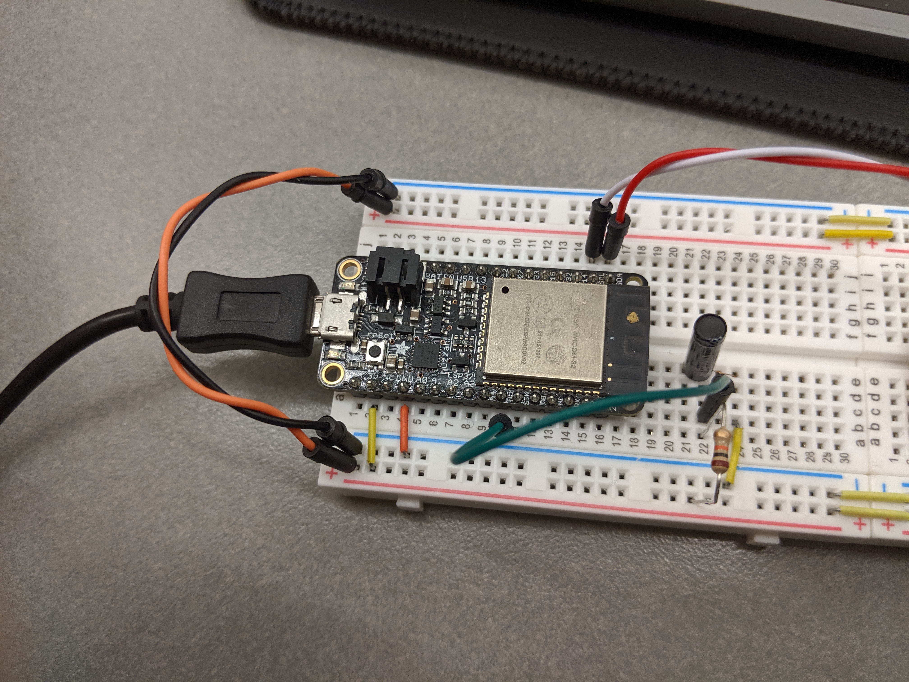

#  Vibration switch (hardware interrupts)

Author: Vanessa Schuweh, 2019-10-24

## Summary
In this skill, I wired up the fast vibration sensor switch to an ESP32 to light up the onboard LED when the sensor is triggered. I used the ESP GPIO interrupt code example as my base code and modified the task in the interrupt handler to filter and eliminate switch debounce. In other words, the filter will count multiple bounces as one tap. The program will print tap to the console when the switch is closed and light up the onboard LED.

## Sketches and Photos
Wire up with pull up resistor for vibration sensor

## Modules, Tools, Source Used in Solution
* ESP32
* Fast Vibration Sensor Switch
* Interrupt
* Debouncing

## Supporting Artifacts
* [Sparkfun Pull-up Resistor](https://learn.sparkfun.com/tutorials/pull-up-resistors)
* [ESP GPIO Interrupt Code Examples](https://github.com/espressif/esp-idf/tree/master/examples/peripherals/gpio)
* [ESP32 Interrupt Allocation](https://esp-idf.readthedocs.io/en/latest/api-reference/system/intr_alloc.html)

-----

## Reminders
- Repo is private
