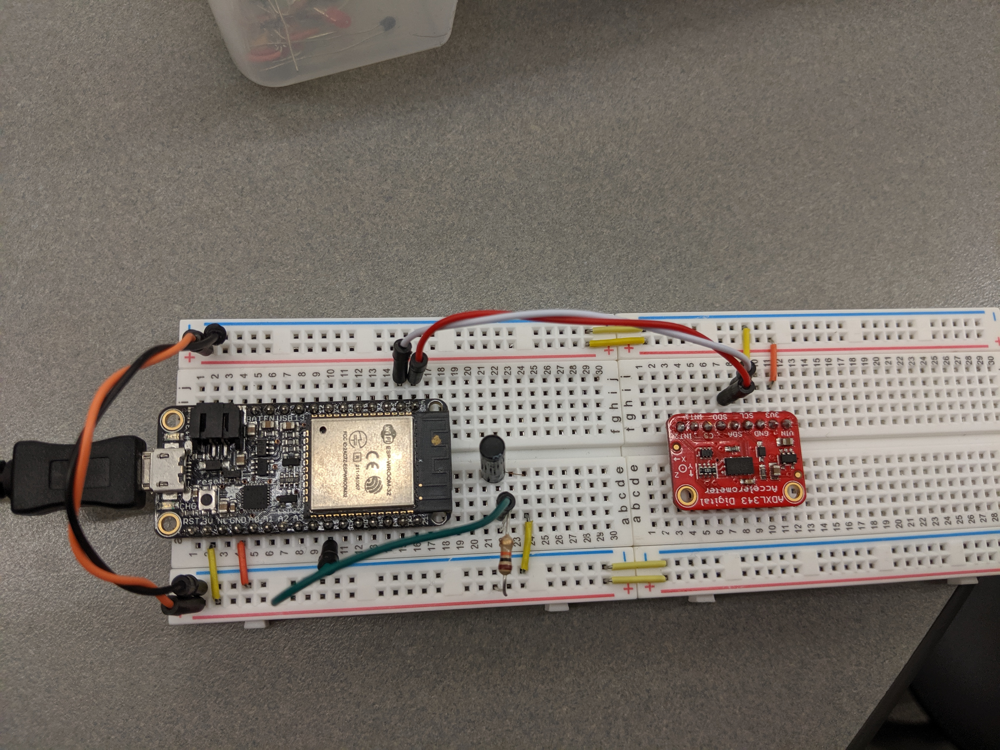

#  Triple-axis Accelerometer

Author: Vanessa Schuweh 2019-10-24

## Summary

In this skill, we wired up an ADXL343 accelerometer to an ESP32 to get tilt angles. We started with the ADXL343 base code and modified it to include ADXL343 functions to write and read from registers and read from a 16bit register. We also added the equation for the calcRP() function to convert x,y,z static acceleration values to tilt angles (roll and pitch).

## Sketches and Photos
wire up of ADXL343

## Modules, Tools, Source Used in Solution
* I2C
* SPI
* ESP32
* Adafruit ADXL343

## Supporting Artifacts
* [I2C Brief](http://whizzer.bu.edu/briefs/design-patterns/dp-i2c)
* [ADXL343 Base Code](https://github.com/BU-EC444/code-examples/tree/master/i2c-accel)
* [ESP I2C API](https://docs.espressif.com/projects/esp-idf/en/latest/api-reference/peripherals/i2c.html)
* [Tilt Sensing](https://wiki.dfrobot.com/How_to_Use_a_Three-Axis_Accelerometer_for_Tilt_Sensing)

-----

## Reminders
- Repo is private
