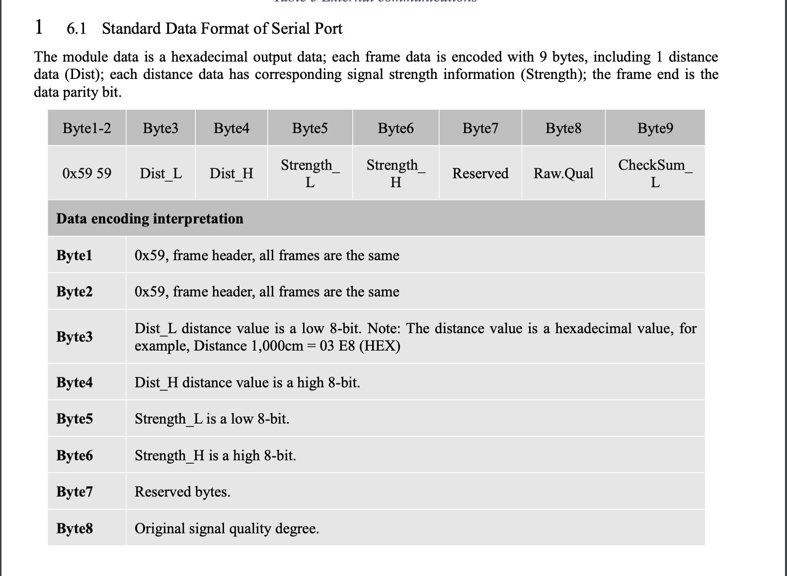

#  MicroLIDAR

Author: Vindhya Kuchibhotla, Jennifer Norell, Vanessa Schuweh, 2019-11-08

## Summary
For this skill we used a MicroLIDAR sensor to measure distance. We did this by using UART to read values coming through, store them in a buffer and then parse this data. We look specifically for two header bits (both are 0x59) followed by two bits used to find the distance.

## Sketches and Photos

## Modules, Tools, Source Used in Solution

* MicroLIDAR
* ESP32

## Supporting Artifacts

* http://whizzer.bu.edu/skills/lidar-LED
* https://github.com/opensensinglab/tfmini/blob/master/src/TFMini.cpp
* https://cdn.sparkfun.com/assets/5/e/4/7/b/benewake-tfmini-datasheet.pdf

-----

## Reminders
- Repo is private
