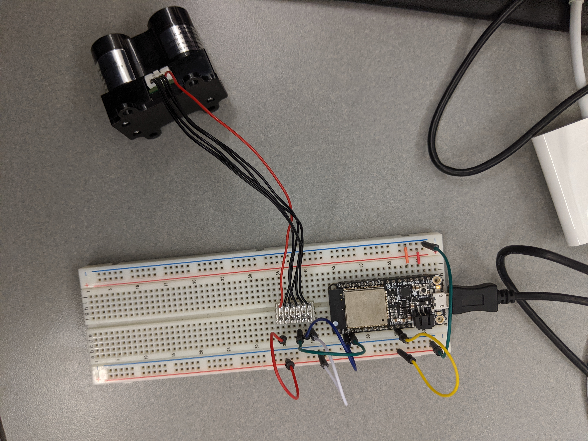

#  Bringing up the LIDAR

Author: Vindhya Kuchibhotla, Jennifer Norell, Vanessa Schuweh, 2019-11-08

## Summary
In this skill, we wired up the LIDAR according to the specs found in the data sheet and wrote a program to have the sensor output the distance in centimeters continuously to the console. We modified the I2C code from the accelerometer skill to write and read from the registers. We then followed the interfacing guidelines from the skill document to retrieve data from the sensor and display it on the console. Furthermore, we referenced the Arduino code to interface with the LIDAR registers. Finally, we decided that this sensor will be attached to the front of our crawler to prevent collisions because it tested to be our most accurate sensor.

## Sketches and Photos
wire up of LIDAR sensor

## Modules, Tools, Source Used in Solution
* I2C
* ESP32
* LIDAR-Lite V1

## Supporting Artifacts
* [LIDAR Lite Arduino example](https://www.robotshop.com/community/blog/show/lidar-lite-laser-rangefinder-simple-arduino-sketch-of-a-180-degree-radar)
* [LIDAR Lite Data Sheet](https://www.google.com/url?sa=t&rct=j&q=&esrc=s&source=web&cd=5&ved=2ahUKEwi6xc7kisjlAhWmTN8KHegqCrQQFjAEegQIBhAC&url=https%3A%2F%2Fwww.robotshop.com%2Fmedia%2Ffiles%2Fpdf%2Foperating-manual-llm20c132i500s011.pdf&usg=AOvVaw0mQTVV6kZEWDT6VQKrsuZW)

-----

## Reminders
- Repo is private
