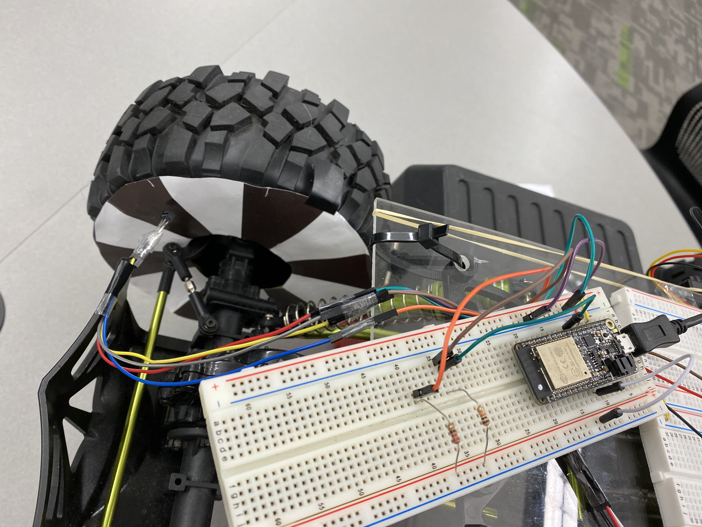

#  Wheel and Car Speed Sensor

Author: Vindhya Kuchibhotla, Jennifer Norell, Vanessa Schuweh, 2019-11-08

## Summary
In this skill, we wired up an optical encoder to our ESP32. The module has two separate components: the emitter light which is wired to always be on, and the interfacing sensor that outputs different voltages when emitted onto black and white surfaces. We used the pulse counter and timer examples from the espidf examples as our base code and modified it to count the number of pulses in a time period to get rotations per minute then used that value to calculate velocity in meters per second. Lastly, we printed out the encoder pattern and attached it to the inner side of the back left wheel and placed the emitter and sensor as close as possible to the encoder.

## Sketches and Photos
wire up of optical encoder sensor

## Modules, Tools, Source Used in Solution
* ESP32
* GPIO
* Timer groups
* Pulse counter

## Supporting Artifacts
* [Sparkfun Guide to Optical Encoder](https://learn.sparkfun.com/tutorials/qrd1114-optical-detector-hookup-guide#example-circuit)
* [ESP32 Pulse Counter](https://esp-idf.readthedocs.io/en/latest/api-reference/peripherals/pcnt.html)
* [ESP32 Timer](https://esp-idf.readthedocs.io/en/latest/api-reference/peripherals/timer.html)
* [ESPidf timer group example](https://github.com/espressif/esp-idf/tree/master/examples/peripherals/timer_group)
* [ESPidf pulse counter example](https://github.com/espressif/esp-idf/tree/master/examples/peripherals/pcnt)

-----

## Reminders
- Repo is private
